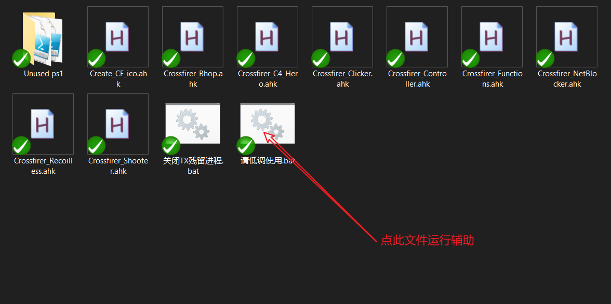
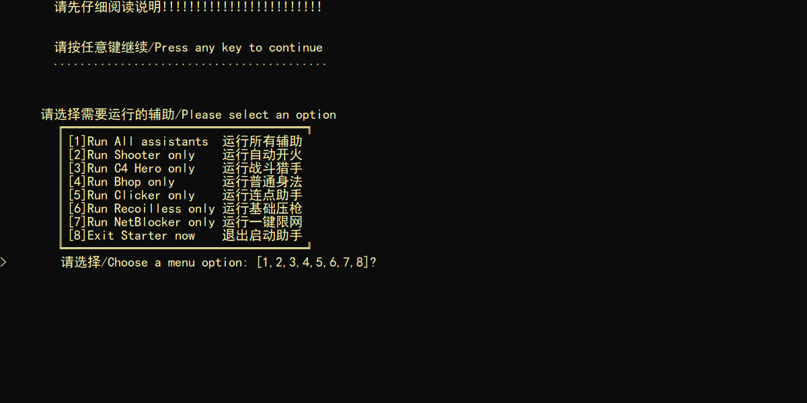
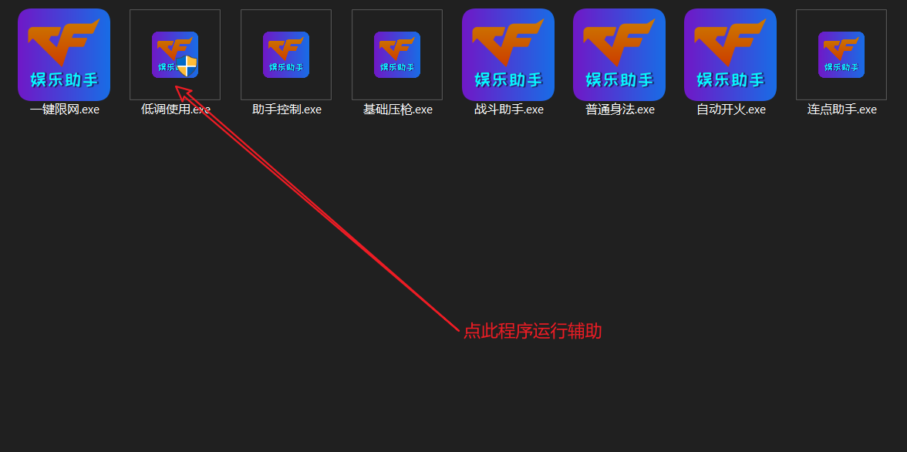
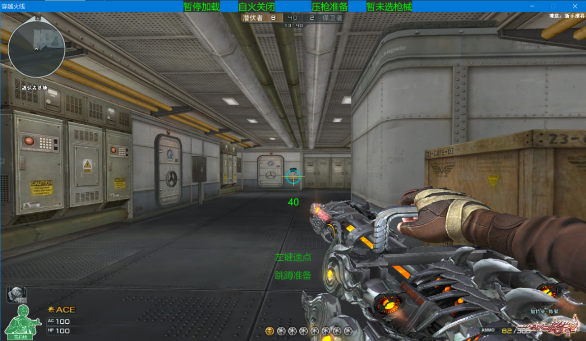
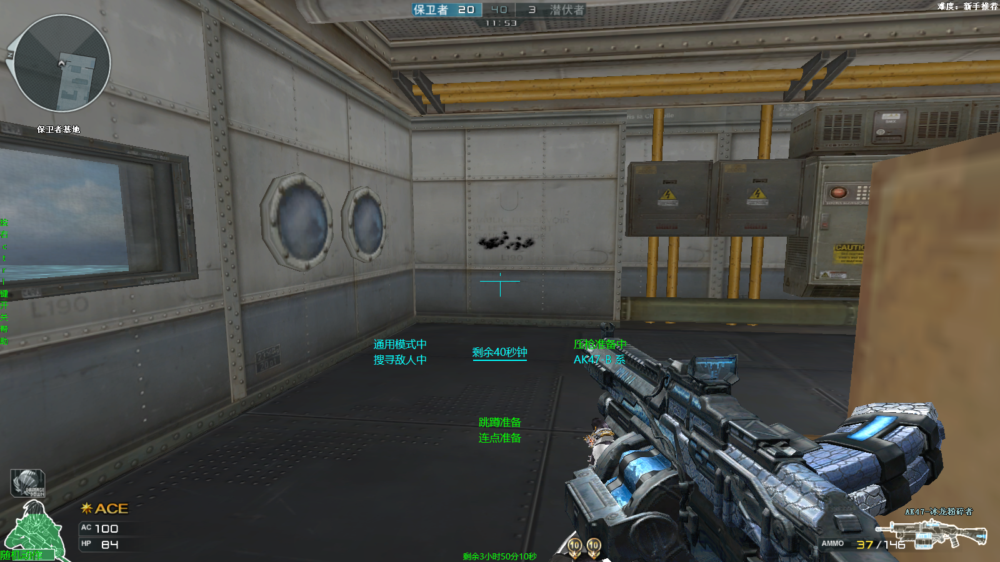
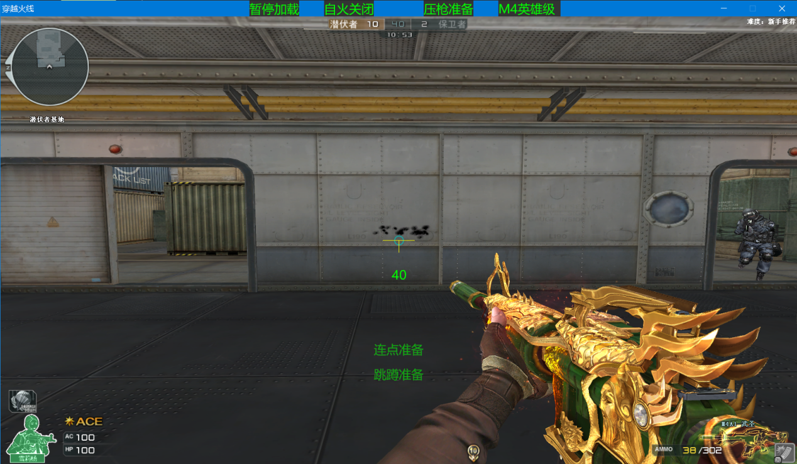

# 火线娱乐脚本

## 介绍(不会有英文介绍的)
火线娱乐脚本，拥有红名自动开火、鼠标连点、跳蹲、扫射压枪、C4报时、秒变猎手等功能。适用于Win7+系统(因为ahk版需要powershell)。适合手残党以及高手挂机式随便打打。建议**窗口化**运行。

## 使用说明
1.  请先[安装ahk](https://www.autohotkey.com/download/ahk-install.exe)；这里是[安装教程](https://seujxh.wordpress.com/2018/09/11/ahk%E5%85%A5%E9%97%A8%E6%95%99%E7%A8%8B1-%E5%AE%89%E8%A3%85%E6%B5%81%E7%A8%8B/)；穿越火线**窗口化**并且分辨率为**1600*900**；鼠标灵敏值设为32(为了压枪)；800 DPI
2.  如果客户端界面位置发生变化请按靠右边的Alt键对准，一次不行多按几次(发行版的exe可能一次无法完全调整对准)，~~启动脚本后请等待三秒左右不然可能遇到警告~~
3.  ~~以管理员模式运行脚本或者右键选择“Run with UI Access”~~ ~~直接双击，按提示选择管理员或者UI Access~~ 直接打开bat文件然后选择你想打开的功能或者打开发行版里的双击我启动助手!!!.exe
4.  按下“~”键开启、关闭脚本自瞄动开火部分，按Tab或2或J或L切换模式，按3或4暂停模式, 按1重启被暂停的模式，所有循环都可按3跳出
5.  任何时候可运行鼠标连点，按下滚轮键或鼠标前进后退键切换模式，按下“~”键退出连点循环，或者按照情况按下“E”、“R”、鼠标左右键退出连点循环，对加特林系列的压枪接近无后坐力且...腾讯还不管我
6.  脚本自动开火部分关闭后可运行扫射压枪，按下小键盘数字选择枪械，目前仅适配M4A1英雄级和AK47英雄级，仅能在新运输船起始房间的宽度距离下将扫射弹道大致压到一条线上，有鼠标灵敏度和dpi限制
7.  任何时候同时按下“W”、“F”可进行基本鬼跳；同时按下“W”、“Alt”可进行空中跳蹲；同时按下“S”、“F”可进行跳蹲上墙
8.  按下"-"键重新加载脚本
9.  按下"="键打开秒变猎手功能，游戏界面靠中间最顶端会有颜色提示
10. 同时按下"C"和"4"键打开C4计时功能(期间移动客户端位置会暂时失效)，同时按下"C"和"5"或直接按"="取消C4计时功能
11.  运行脚本时将获得即时状态提示

## 额外说明
* **[50_CPS_Test]以及[Win10_CF烟雾头_2018]文件夹内不是我的作品，而是引用了其他人的项目，放在一起方便使用**
### 优点：
* **无注入游戏内存**
* AHK占用内存低/占用CPU低
* 拥有简易GUI提示
* 反应极快(自火反应时间预计在0.05秒以下，其中ahk状态在i5-10300h中反应速度为0.021秒，未测试加密编译后的结果)
* 适配所有游戏分辨率以及不带黑边的全屏
* 经过测试运行相对稳定
* 防闪
* 目前West国际版、国内版均可运行(West版本只可运行ahk版本，exe版本可能会造成更多机率意外退出，国服两个版本都行)
* 各功能运行时互相无阻碍(因为文件分开了嘛...在学习测试AHK_H版本的多线程怎么写)
* 关闭游戏后无残留辅助进程(甚至会关闭国服游戏的残留进程GameLoader.exe)
* 无毒，如果遇到杀软误报**请添加信任并保持杀软开启**，如仍然不放心可上传文件至[VirusTotal](https://www.virustotal.com/gui/)等网站验毒...
### 缺点：
* 自动开火部分无法检测极远处和用户名为空白的敌人，或者在游戏偶然不显示敌方红名的情况下无法正常射击
* ~~各个功能之间存在相互干扰机率~~
* 默认不防烟雾(需要调烟雾头才可能防烟雾，请参考2018年[穿越火线Win10 16位烟雾头终极方案](https://www.bilibili.com/read/cv623389/)(感谢作者 鲁汀LT 提供的脚本)或者2020年[穿越火线：一周一个小技巧，WIN10烟雾头调试教程终于来了!](https://www.bilibili.com/video/BV1vK4y187az)及其他烟雾头教程)
* 压枪方面仅适配少部分常用枪械
* ~~分辨率和~~灵敏值未满足要求的需要更改代码中的数值自行适配
* 切换全屏/非全屏时受DPI影响，需要重新加载脚本才能正常工作
* ~~自动开火部分切换模式时可能暂时无法切换，未知原因，但可以通过按下“3”或“4”过渡来切换模式~~
* 压枪部分目前只做到纵向压枪，横向部分因其随机性目前未想到好办法
* ~~瞬狙模式下如果保持行走那么开关镜会受到小小影响(双切枪后本应关镜，但因为采用了暴力检测子弹是否上膛的办法会在开镜状态下停留直到物理按键关镜)~~
* 在新年广场这种色调的地图中容易被干扰
* 备注部分的语言未进行统一，因为有些代码是直接参考网页结果调整的，参考内容及作者日后将写明

### 未来计划
* ~~将所有功能分开，因为L版本的AHK不支持多线程，而文件分开后可以实现诸如C4计时不出现异常、鬼跳过程中射击、自火开启时打提前枪时压枪等操作~~*(已完成)*
* ~~用函数代替所有标签~~*(已完成)*
* 增加其他一些常用枪械的压枪(请有人看的话建议下什么枪需要压)
* ~~读取游戏内存？哈哈哈母鸡~~(读取内存太累了而且失效快主要是**我目前不会**，况且我一个初级编程学者远远比不上国内产业链一条龙服务)
* 适配更多的分辨率，包括适配全屏(初步完成)
* 将PDF文件内的部分内容转到这里
* 使用机器学习训练并将鼠标短时间内指向目标？想想就激动啊哈哈
## 请用小号玩耍！请用小号玩耍！！请用小号玩耍！！！
