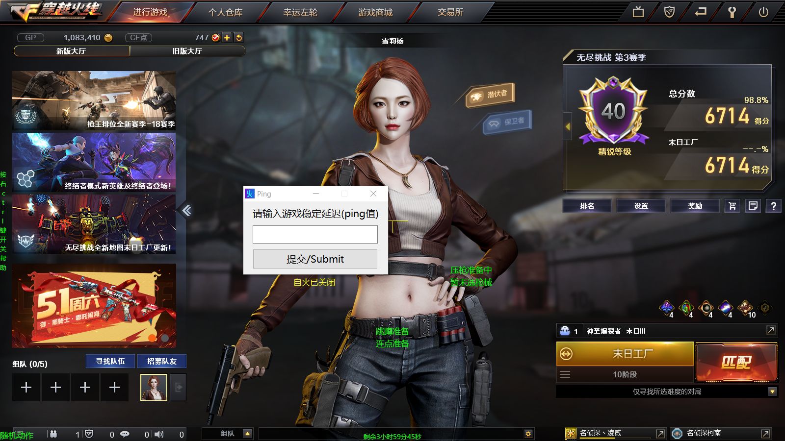

# 火线娱乐辅助

## 介绍(不会有英文介绍的)
火线娱乐辅助，拥有红名自动开火、鼠标连点、跳蹲、扫射压枪、C4计时、秒变猎手、无尽挂机等功能。适用于Win7+系统。适合手残党以及高手挂机。建议**窗口化**运行。这是个学习性质脚本，恳请在以下方面提供意见与帮助:
* 窗口捕获句柄发送消息(尤其是可以精确控制360流量防火墙以及Netlimiter4规则的开关)
* AHK_H多线程(我正在设法将脚本合一，并想保留脚本运行时状态的及时更新)
* 图像识别(基于神经网络)

## 使用说明
* 请先[安装ahk](https://www.autohotkey.com/download/ahk-install.exe)；这里是[安装教程](https://seujxh.wordpress.com/2018/09/11/ahk%E5%85%A5%E9%97%A8%E6%95%99%E7%A8%8B1-%E5%AE%89%E8%A3%85%E6%B5%81%E7%A8%8B/)；穿越火线**窗口化**并且分辨率为**1600*900**；鼠标灵敏值设为32(为了压枪)；1200 DPI
* 如果客户端界面位置发生变化请按靠右边的Alt键对准，一次不行多按几次(发行版的exe可能一次无法完全调整对准)，~~启动脚本后请等待三秒左右不然可能遇到警告~~
* ~~以管理员模式运行脚本或者右键选择"Run with UI Access"~~ ~~直接双击，按提示选择管理员或者UI Access~~ 直接打开Crossfirer_v2.x文件夹中的bat文件然后选择你想打开的功能再运行游戏或者打开发行版里的低调使用.exe
* 按下"-"键重新加载脚本(实际是退出等待cmd界面重新选择运行脚本)
* 运行脚本时将获得即时状态提示，一般黄色为暂停状态，绿色为就绪状态，青色为正在运行，红色为警报(仅自动开火和C4计时部分)，按靠右的Ctrl键将获得简易键位提示
* 游戏中按下回车键可暂停/恢复一切按键触发函数，或者按右边的Alt恢复按键触发，避免打字时错乱
* 按下"?"可开启/关闭游戏内随机动作，避免不活跃被系统踢出房间

### 自动开火部分
* 按下"LCtrl"和"~"键开启、关闭脚本自瞄动开火部分
* 按下V(通用模式)或单独按下2(手枪模式)、J(瞬狙模式)、L(连发速点模式)切换模式，按3或4暂停模式，按1或Tab重启被暂停的模式
* 按鼠标左键就能退出顺狙模式切枪循环，本脚本允许玩家输入当前稳定的延迟ping值(按F7)因为它和瞬狙模式双切枪关联(默认40)

### 基础压枪部分
* ~~脚本自动开火部分关闭后~~任何时候可运行扫射压枪，按下小键盘数字选择枪械，目前仅适配HK417(键位3然后键位Del)M4A1英雄级(键位2)和AK47英雄级(键位1)的扫射以及大部分枪械的点射(键位小键盘Del，点射压枪幅度可以按+键调整)，仅能在新运输船起始房间的宽度距离下将扫射弹道大致压到一条线上，有鼠标灵敏度和dpi限制

### 基础身法部分
* 任何时候先后按下"W"、"F"可进行基本鬼跳
* 先后按下"W"、"Alt"可进行空中跳蹲
* 先后按下"S"、"F"可进行跳蹲上墙
* 先后按下"W"、"C"可进行向前跳跳蹲上箱子
* 先后按下"S"、"C"可进行ESC跳上箱子
* 先后按下"Z"、"C"可进行六级跳箱(有位置限制)
* 先后按下"Z"、"X"可进行前后滑步
* 先后按下"S"、"Alt"可进行后跳连蹲(适用于卡上墙壁和门的结合点)
* 按"<"可进行左侧的后退旋转跳
* 按">"可进行右侧的后退旋转跳

### 战斗助手部分
* 按下"="键打开/关闭秒变猎手功能，同时能在弹药箱边自动补充，游戏界面准星下方会出现"猎手"字样
* 先后按下"C"和"4"键打开C4计时功能(~~期间移动客户端位置会暂时失效~~)，先后按下"C"和"5"或直接按"="取消C4计时功能，C4计时带有简易进度条

### 鼠标连点部分
* 任何时候可运行鼠标连点，按下滚轮键或鼠标前进后退键切换模式，按照情况按下"E"、"R"、鼠标左右键退出连点循环
* 按鼠标前进键开启炼狱连刺(10下)
* 按鼠标后退键或者T键开启炼狱速点(对加特林系列的压枪接近无后坐力，并且因为应用随机函数以及合理点射间隔而大幅减少被tx封杀的几率)
* 按鼠标滚轮键开启右键速点(适合神圣爆裂者)
* 按键盘"|"键开启左键不放
* 按键盘"""键开启大宝剑二段连击
* 按键盘":"键开启炼狱热管

### 一键限网部分
* 按下"H"键可运行一键断网功能(会自动跳起来然后断网，据说可以暂时无敌)，请先运行360流量防火墙或者NetLimiter 4，断网时间国服最大8秒西方服最大6秒，~~运行Netlimiter4版断网时可能出现偶发错误~~使用时将360流量防火墙列表中的穿越火线进程固定到第一行即可，或将NetLimiter 4设置到如下画面并保证其不被最小化，注意采用默认界面，颜色主题随意

### 无尽挂机部分
* **在游戏大厅界面**按"F8"开始自动刷末日工厂(需要默认主武器为神圣爆裂者,默认等级为6)，**然后**再按"?"键防止被系统判定不活跃踢出房间
* 按"Esc"键退出挂机循环，按"?"键退出随机移动
* 当日存在黑暗属性时脚本表现变差(影响到屏幕取色)
* 实际时间超出18分钟未通过后会自动退出(游戏内计时25分种实际只有14分钟不到)然后再开一局
* 火力输出为正常打的一半左右，~~建议在大哥多的时候挂机~~，在最终Boss出现前为右键蓄力攻击，出现后会自动试图寻找Boss胸口的黄色核心并左键攻击

## 额外说明
* **[50_CPS_Test](https://github.com/JiaPai12138/Crossfirer/tree/main/50_CPS_Test)以及[Win10_CF烟雾头_2018](https://github.com/JiaPai12138/Crossfirer/tree/main/Win10_CF%E7%83%9F%E9%9B%BE%E5%A4%B4_2018)文件夹内不是我的作品，而是引用了其他人的项目，放在一起方便使用**
### 优点：
* **无注入游戏内存**
* AHK占用内存低/占用CPU低
* 拥有简易GUI提示
* 反应极快(自火反应时间预计在0.05秒以下，其中在i5-10300h中反应速度为0.021秒，未测试加密编译后的结果)
* 适配所有游戏分辨率以及**不带黑边**的全屏
* 防闪
* 目前West国际版、国内版均可运行(~~West版本只可运行ahk版本，exe版本可能会造成更多机率意外退出~~疑似西方版放弃了反外挂，因而目前两个版本都行)
* 各功能运行时互相无阻碍(因为文件分开了嘛...在学习测试AHK_H版本的多线程怎么写，以及希望v2版本出多线程)
* 如果按照说明规范启动脚本的话关闭游戏后无残留辅助进程(甚至会关闭国服游戏的残留进程GameLoader.exe等)
* 无毒，如果遇到杀软误报**请添加信任并保持杀软开启**，如仍然不放心可上传文件至[VirusTotal](https://www.virustotal.com/gui/)等网站验毒...(智量20210416时曾对编译版本报毒MEMRAY:MalCode.L，添加信任即可，本脚本不读内存只是把一些图标预先存在内存中而已)

### 缺点：
* 自动开火部分无法检测极远处和用户名为空白的敌人，或者在游戏偶然不显示敌方红名的情况下无法正常射击
* ~~各个功能之间存在相互干扰机率~~
* 默认不防烟雾(需要调烟雾头才可能防烟雾，请参考2018年[穿越火线Win10 16位烟雾头终极方案](https://www.bilibili.com/read/cv623389/)(感谢作者 鲁汀LT 提供的脚本)或者2020年[穿越火线：一周一个小技巧，WIN10烟雾头调试教程终于来了!](https://www.bilibili.com/video/BV1vK4y187az)及其他烟雾头教程)
* 压枪方面仅适配少部分常用枪械，未来最多将只考虑使用量最大的几款枪进行开发
* ~~分辨率和~~DPI和灵敏值未满足要求的需要更改代码中的数值自行适配
* 切换全屏/非全屏时受DPI影响，需要重新加载脚本才能正常工作
* ~~自动开火部分切换模式时可能暂时无法切换，未知原因，但可以通过按下"3"或"4"过渡来切换模式~~
* 压枪部分目前只做到纵向压枪，横向部分因其随机性目前未想到好办法
* ~~瞬狙模式下如果保持行走那么开关镜会受到小小影响(双切枪后本应关镜，但因为采用了暴力检测子弹是否上膛的办法会在开镜状态下停留直到物理按键关镜)~~
* ~~自动开火在新年广场这种色调的地图中可能被干扰~~
* ~~由于使用了图像搜索，对于一些用户的Netlimiter界面字样可能无法识别~~
* ~~小部分备注部分的语言未进行统一，因为有些代码是直接参考网页结果调整的，参考内容及作者日后将写明~~

### 未来计划
* ~~将所有功能分开，因为L版本的AHK不支持多线程，而文件分开后可以实现诸如C4计时不出现异常、鬼跳过程中射击、自火开启时打提前枪时压枪等操作~~*(已完成)*
* ~~用函数代替所有标签~~*(已完成)*
* ~~增加其他一些常用枪械的压枪(请有人看的话建议下什么枪需要压)~~*(已放弃)*
* 增强战术性的压枪，即尽可能将前5到7发子弹压到一个点上，而放宽对扫射压枪的要求
* ~~读取游戏内存？哈哈哈母鸡~~(读取内存太累了而且失效快主要是**我目前不会**，况且我一个初级编程学者远远比不上国内产业链一条龙服务)
* 适配更多的分辨率，包括适配全屏(初步完成)
* ~~增加新版界面的自动刷无尽挑战(暗黑营地)~~*(已完成)*
* 使用多线程，未来的发行版中将只有一个exe文件
* 使用机器学习训练并将鼠标短时间内指向目标？想想就激动啊哈哈
## 请用小号！请用小号！！请用小号！！！
