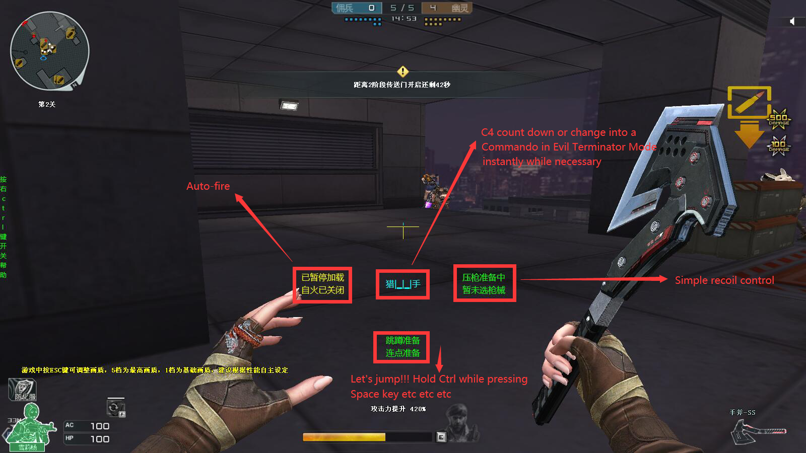
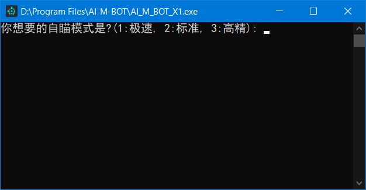
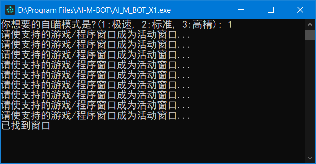

# 火线娱乐辅助 𝕮𝖗𝖔𝖘𝖘𝖋𝖎𝖗𝖊𝖗

      

          

## HOW TO USE 📄📄📄
* If you want to use it from source, please install [AHK](https://www.autohotkey.com/download/ahk-install.exe) first, and here is [how](https://www.youtube.com/watch?v=lEielN4nXL0).
* If the simple gui is not at the right position, please press "left Alt" key multiple times until it comes true.
* Double click the **bat** file with shorter file name under Crossfirer_v2.x folder, and then press 1.Or double click the exe file highlighted in the following image.
* press "-" to restart the program (script)
* You will always get status notification from the color of the font in simple gui, normally yellow  means paused, green  means ready to go, cyan  means is working, red  means alert (red only appears in anto-fire and c4 notification), press "right Ctrl" key for hints of hotkeys.
* Press "Enter" key once can pause/resume all functions in order not to get errors while typing, press "right Alt" key can also resume all functions.
* Press "?" key can start/stop random moves in game in order not to get kicked from game room because of not being active enough.
* Press "Up"/"Down" key can increase/decrease playing time, since this program will automatically close the game after certain time period (default is 4 hours)

### <u>Auto-fire</u>
* Press "Left Ctrl" and "~" key to open/close Auto-fire.
* Press "K" key (normal mode) or "2" key (pistol mode)、or "J" key (sniper mode)、or "L" key (press longer mode - for submachine guns and auto sniper rifles and shotguns etc) to start or change mode.
* Press "3" or "4" key to pause mode, and press "1" or "Tab" key to restart the paused mode.
* Press "F7" key to change ping value, which is for sniper mode (default value is 40)

### <u>Simple recoil control</u>
* ~~脚本自动开火部分关闭后~~任何时候可运行扫射压枪, 按下小键盘数字选择枪械, 目前仅适配HK417(键位3然后键位Del)M4A1英雄级(键位2)和AK47英雄级(键位1)的扫射以及大部分枪械的点射(键位小键盘Del, 点射压枪幅度可以按+键调整), 仅能在新运输船起始房间的宽度距离下将扫射弹道大致压到一条线上, 有鼠标灵敏度和dpi限制

### <u>基础身法部分</u>
* 任何时候先后按下"W"、"F"可进行基本鬼跳
* 先后按下"W"、"Alt"可进行空中跳蹲
* 先后按下"S"、"F"可进行跳蹲上墙
* 先后按下"W"、"C"可进行向前跳跳蹲上箱子
* 先后按下"S"、"C"可进行ESC跳上箱子
* 先后按下"Z"、"C"可进行六级跳箱(有位置限制)
* 先后按下"Z"、"X"可进行前后滑步
* 先后按下"S"、"Alt"可进行后跳连蹲(适用于卡上墙壁和门的结合点)
* 按"<"可进行左侧的后退旋转跳
* 按">"可进行右侧的后退旋转跳

### <u>战斗助手部分</u>
* 按下"="键打开/关闭秒变猎手功能, 同时能在弹药箱边自动补充, 游戏界面准星下方会出现"猎手"字样
* 先后按下"C"和"4"键打开C4计时功能(~~期间移动客户端位置会暂时失效~~), 先后按下"C"和"5"或直接按"="取消C4计时功能, C4计时带有简易进度条

### <u>鼠标连点部分</u>
* 任何时候可运行鼠标连点, 按下滚轮键或鼠标前进后退键切换模式, 按照情况按下"E"、"R"、鼠标左右键退出连点循环
* 按鼠标前进键开启炼狱连刺(10下)
* 按鼠标后退键或者T键开启炼狱速点(对加特林系列的压枪接近无后坐力, 并且因为应用随机函数以及合理点射间隔而大幅减少被tx封杀的几率)
* 按鼠标滚轮键开启右键速点(适合神圣爆裂者)
* 按键盘"|"键开启左键不放
* 按键盘"""键开启大宝剑二段连击
* 按键盘":"键开启炼狱热管

### <u>一键限网部分</u>
* 按下"H"键可运行一键断网功能(跳起来然后断网据说可以暂时无敌), 请先运行360流量防火墙或者NetLimiter 4, 断网时间国服最大8秒西方服最大6秒, ~~运行Netlimiter4版断网时可能出现偶发错误~~使用时将360流量防火墙列表中的穿越火线进程固定到第一行即可, 或将NetLimiter 4设置到如下画面并保证其不被最小化, 注意采用默认界面, 颜色主题随意

### <u>无尽挂机部分</u>
* **在游戏大厅界面**按"F8"开始自动刷末日工厂(需要默认主武器为神圣爆裂者, 默认等级为6), **然后**再按"?"键防止被系统判定不活跃踢出房间
* 按方向左/右键下调/上调挑战等级
* 按"Esc"键退出挂机循环, 按"?"键退出随机移动
* 当日存在黑暗属性时脚本表现变差(影响到屏幕取色)
* 实际时间超出18分钟未通过后会自动退出(游戏内计时25分种但有人死就扣时间)然后再开一局
* 火力输出为正常打的一半左右, ~~建议在大哥多的时候挂机~~, 在最终Boss出现前为右键蓄力攻击, 出现后会自动试图寻找Boss胸口的黄色核心并左键攻击

### <u>YOLO AIMBOT</u>
* 使用自瞄时请将游戏分辨率调整至**1600*900**及以下, 将画面效果调整至**中等**及以下
* 需要计算能力6.1及以上版本的**N卡**以及安装相应驱动, 详情请见[CUDA wiki](https://zh.wikipedia.org/wiki/CUDA)
* 按1或2或3或4选择自瞄模式(图像预测尺寸递增, 预测速度递减)
* 等待游戏窗口成为当前活动窗口(点击一下游戏窗口即可)
* 脚本正常工作时桌面左上角会显示截屏识别区域小视频
* 按"1"/"2"键保持自瞄状态并控制鼠标
* 按"3"/"4"键保持自瞄状态但不控制鼠标
* 按"j"开启自动开火模式(不控制鼠标移动)
* 按"f"恢复自瞄模式
* 按"p"键重启程序
* 按"END"结束程序
* 自瞄只截屏识别准星附近区域, 对于16:9的CF游戏窗口识别区域大小为(高=游戏窗口高*1/2, 宽=高*4/3)
* 本程序使用python语言以及自源码编译的opencv-cuda加速库
* 本程序目前使用yolov4-tiny模型, 只因其快(目前使用b站大佬[VeniVediVeci](https://space.bilibili.com/196421117)训练的权值)
* 本程序**很吃性能**, 使用前请先确认您的电脑配置: [GPU天梯1](http://cdn.malu.me/gpu/), [GPU天梯2](https://topic.expreview.com/GPU/)或[参考知乎](https://zhuanlan.zhihu.com/p/133845310)

## ELSE 📃📃📃
* **[50_CPS_Test](https://github.com/JiaPai12138/Crossfirer/tree/main/50_CPS_Test) folder is not my work, just put it together for easier using**
